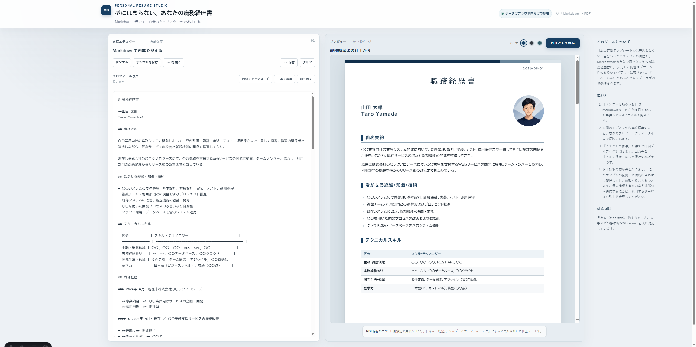

# Markdown Resume Studio

日本の定番テンプレートでは表現しにくい、自分らしさとキャリアの個性を、Markdownから組み立てられる職務経歴書に。

入力した内容は、デザイン性のあるA4レイアウトに整形されます。サーバーに送信されることなく、ブラウザ内だけで編集・プレビュー・PDF保存まで完結します。

🌐 [デモを試す](https://md-resume.jahom.dev/)



## 使い方

1. 「サンプルを読み込む」でMarkdownの書き方を確認するか、「サンプルをダウンロード」または「.mdを開く」から原稿を用意します。
2. 左側のエディタで内容を編集すると、右側のプレビューにリアルタイムで反映されます。
3. 必要に応じてテーマ、プロフィール写真、写真の表示形状を調整します。
4. 「PDFとして保存」を押し、印刷ダイアログの出力先を「PDFに保存」にして保存します。

## 連絡先を表示する

名前の直後に、メールアドレスやプロフィールページを1行で記述すると、履歴書のタイトル下に連絡先として中央揃えで表示されます。Emailはテキストとして表示し、LinkedIn、GitHub、Portfolio、個人サイト、SNSなどのURLはMarkdownリンクとして設定できます。

```md
Phone: 090-0000-0000 · Email: your.email@example.com · [LinkedIn](https://www.linkedin.com/in/your-name/) · [GitHub](https://github.com/your-name) · [Portfolio](https://portfolio.example.com)
```

## AIで原稿を整える

すでに履歴書や職務経歴書の原稿がある場合は、AIにサンプルのMarkdownと自分の原稿を渡し、次のように依頼できます。

> このサンプルの見出しと構成に合わせて、私の職務経歴書をMarkdownとして整理してください。内容は変更せず、情報が足りない部分は「〇〇」などのプレースホルダーにしてください。

外部AIサービスに個人情報を含む原稿を送信する場合は、利用するサービスの設定と取り扱いを確認してください。

## 対応している記法

- 見出し（`#`、`##`、`###` など）
- 箇条書き、番号付きリスト
- 表
- 太字、斜体、リンク
- 段落、改行、水平線

プロジェクトの見出しは、`####` などの下位見出しを使うと、会社・職務・プロジェクトの関係を整理しやすくなります。

## プライバシー

Markdownの入力内容とアップロードしたプロフィール写真はブラウザ内で処理され、外部サーバーへ送信されません。ブラウザのローカルストレージに保存された内容は、同じブラウザで再訪したときに復元されます。

重要な原稿は、必要に応じて「.md保存」から手元にも保存してください。
